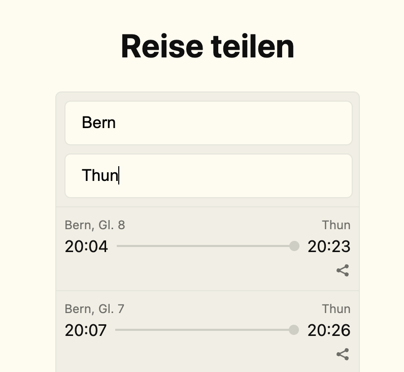
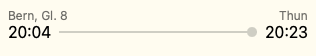

## Share a train journey with the browser share API

This [demo](https://gobeli.github.io/journey-share-image/) creates a png based on a train journey which can be shared via the share API. The share API is not widely supported, use an Android device with Chrome or iOS with Safari for it to work.

### Example

Clicking the share button on the first element will generate the following picture to be shared:

This way the receiver of the train connection sees the departure immediately and does not have to follow the link.